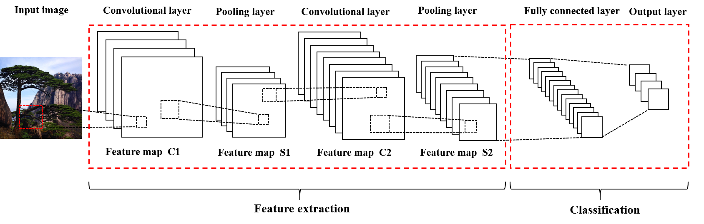

# Image-classification
Image classification with SIFT and Neural network
We roughly categorize the photos extracted from Instagram of Huangshan City, China into 5 categroies: Architecture, Cloud, Food, Pine, Hiking.Then, we manually label 100 images for each of the 5 categories, for a total of 500 images. With this set at hand, we randomly split the data with keeping 80% of the data as training data and 20% of data as testing data.
- The Architecture category includes the photos of ancient architecture, like ancient residential houses, memorial archways, shrines, bridges, and street;
- The Cloud category includes the photos of cloud, sunset, sunrise, and sky; 
- The Food category includes the photos of food, drinks, recipes;
- The Pine category includes the photos whose main object is pine tree; 
- The Hiking category includes the photos taken while people are hiking.

## SIFT + Bag-of-words + Kmeans + SVC
- First, we use the scale-invariant feature transform (SIFT) algorithm  to extract a set of key features for images in the dataset; The extracted key features are invariant to image translation, scaling, and rotation, as well as partial invariant to illumination changes and robustness to geometric distortions. Then, k-means clustering algorithm is used to cluster the extracted key feature vectors, which provides a set of codewords to form the dictionary of our bag-of-words (BOW) representation. Next, for the extracted SIFT features of an image, we assign each feature to the closest BOW, which allows us to express the image as a histogram of BOW. 
- Finally, we train the corresponding histograms of labelled images with Support Vector Machine (SVM) algorithm, to get the SVM image classifier. For the unlabeled images, we classify the BOW presentations with the SVM image classifier. The output is a vector of probability classified to each category and the category with maximum probability is the label of the unlabeled image. 

## Convolutional Neural Network
- Neural networks and a set of derivative algorithms have long been implemented for image classification. A neural network is composed of multiple layers, and each layer has a various number of neurons with trainable weights and biases. All the neurons are fully connected to the neurons in previous and post layers. The first layer is input layer, whose input is the input data. The last layer is the output layer, whose output is the predicted result. Other layers are called hidden layer processing and passing the information from the previous layer to post layer.
- CNNs are a category of Neural Networks that have demonstrated effectiveness in various fields such as image recognition and video analysis. The CNN architectures consist of three basic components, which are convolutional layer, pooling layer, and fully connected layer (Figure 1). Each layer is composed of a certain number of feature maps, which indicates a level of feature representation. The convolutional layer and pooling layer together act like a hidden layer in traditional neural network. The convolutional layer consists of multiple convolution units, which acts like the weight-sharing version of the traditional neural network and is designed to learn filtering-based feature representation of the inputs. It can reduce the model complexity thus making the network easier to train. The pooling layer is often inserted between two successive convolutional layers and is designed for non-linear down-sampling to achieve invariance to some degree. The fully connected layer can be viewed as the classifier.

#### Figure 1. CNN Architecure

